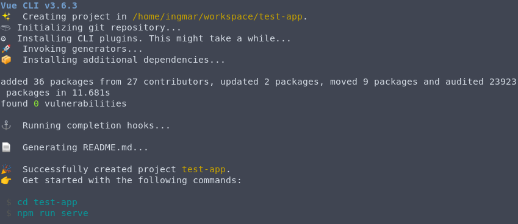
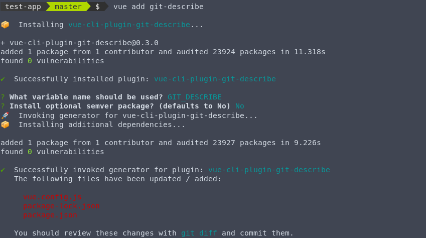

# Vue CLI plugin git-describe

[](https://www.npmjs.com/package/vue-cli-plugin-git-describe)
[](https://www.npmjs.com/package/vue-cli-plugin-git-describe)
[](https://travis-ci.org/idelsink/vue-cli-plugin-git-describe)

This [Vue CLI](https://cli.vuejs.org/) plugin calls
[git-describe](https://www.npmjs.com/package/git-describe) with the provided arguments on the working directory or any other directory and
parses the output to individual components. On compilation time the
git-describe information will be injected so that it can be used in, for example,
browser served applications which have no access to the local file system.

## Installation

Available from npm:

```shell
$ vue add git-describe
```

This will ask a few questions and will install the plugin.

Tests are not included in the npm package —
clone the git repository to run tests.

## Usage

git-describe uses the node [git-describe](https://www.npmjs.com/package/git-describe) module.
During compilation, the variable `variableName`, default `GIT_DESCRIBE`, is replaced with the
[git-describe](https://www.npmjs.com/package/git-describe#example-output) object.

### Example

1. Create an example app (Skip this step if you want to use your own application)
   ```shell
   $ vue create test-app && cd test-app
   ```
   
2. Install the git-describe plugin
   ```shell
   $ vue add git-describe
   ```
   
3. Add the configured constant, default `GIT_DESCRIBE`, to your code.
  ```JavaScript
  console.log('App version', GIT_DESCRIBE.raw);
  ```
  Outputs:
  ```text
  App version c6bd20d-dirty
  ```

## Options

`git-describe` has the following options available in the `vue.config.js` file:

```JavaScript
module.exports = {
  pluginOptions: {
    gitDescribe: {
      variableName: 'GIT_DESCRIBE'  // The compile-time global constant varialbe name to use in the code.
    }
  }
}
```

## Example output

```javascript
{
    dirty: false,
    hash: 'g3c9c15b',
    distance: 6,
    tag: 'v2.1.0-beta',
    semver: SemVer, // SemVer instance, see https://github.com/npm/node-semver
    suffix: '6-g3c9c15b',
    raw: 'v2.1.0-beta-6-g3c9c15b',
    semverString: '2.1.0-beta+6.g3c9c15b'
}
```

## More information

See [git-describe](https://www.npmjs.com/package/git-describe) for more information about the usage of the git-describe package and the reason to include the optional [semver](https://github.com/npm/node-semver) package.

## Tests

Tests can be run by cloning the repository and running the following command.

```sh
$ npm install
$ npm test
```
